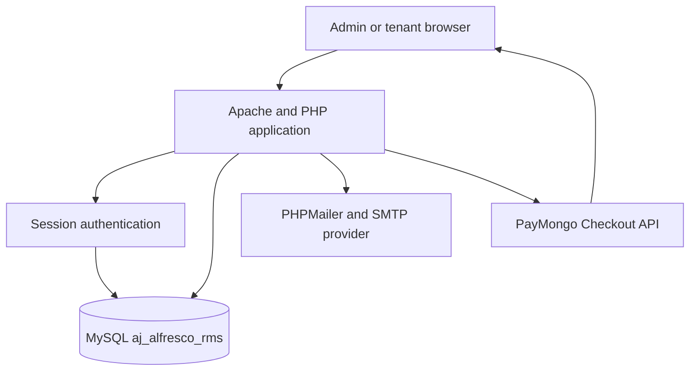
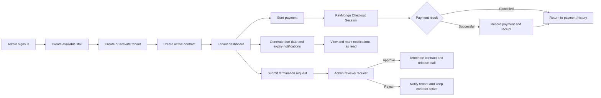

# A&J Alfresco Rental Management System

## Short description

A&J Alfresco is a web-based rental management system for food-park operations. It helps administrators manage stalls, tenants, contracts, payments, receipts, reports, and notifications, while tenants can view their rental information and pay online.

## Features

### Admin portal

- Dashboard counts for available stalls, occupied stalls, active contracts, and payment activity
- Create and update stalls with a number, name, location, monthly rate, size, and status
- Register tenants and manage their account status and business details
- Create contracts that connect an active tenant to an available stall
- Track contract dates, rent, deposits, terms, duration, and lifecycle status
- Record cash or manually verified payments
- View payment history, search records, and print receipts
- View payment reports
- Filter and mark notifications as read
- Review tenant termination requests and approve or reject them from the dashboard
- Force-send rent-due and contract-expiry email reminders from `admin/test_reminders.php`

### Tenant portal

- Secure login with separate admin and tenant roles
- Tenant dashboard with contract, payment, and reminder summaries
- View contract details and the generated PDF agreement
- Submit renewal and termination requests for an active contract
- Start a PayMongo Checkout payment for the current rental contract
- View payment history and print individual receipts
- Filter notifications by payment or contract expiry and mark them as read
- Change the account password

### Notifications and reminders

Loading the tenant dashboard creates applicable due-date and contract-expiry notifications. Notification types are stored as `due_date`, `contract_expiry`, `payment`, or `general`. The admin reminder test page can send rent reminders for 7, 3, or 1 day before the due date and contract-expiry reminders for 90, 60, or 30 days before expiry. SweetAlert2 is used for tenant action confirmations and notification dialogs.

Termination requests require administrator approval. A tenant submits a request from the contract page, the request appears in the admin dashboard, and the admin can approve or reject it. Approval changes the contract to `terminated` and makes the stall `available`; rejection keeps the contract active and notifies the tenant.

## Technology stack

- PHP 8.x
- MySQL with InnoDB and `utf8mb4`
- Apache and PHP through XAMPP
- Server-rendered HTML, CSS, and JavaScript
- PayMongo Checkout API
- PHPMailer through the included Composer vendor directory
- FPDF for generated contract documents
- SweetAlert2 and Font Awesome loaded from CDNs

## Requirements

- Windows with XAMPP, or an equivalent Apache/PHP/MySQL environment
- PHP extensions used by the application, including `mysqli` and `curl`
- A PayMongo account and API keys for online payments
- A Gmail account with an app password, or another SMTP-compatible mail account

## Step-by-step setup

### 1. Clone the repository

Open PowerShell or Git Bash and clone the project into the XAMPP web root:

```powershell
cd C:\xampp\htdocs
git clone https://github.com/YoursTrulyInarius/aj-alfresco.git
cd aj-alfresco
```

If the project is already downloaded, open its existing directory instead of cloning it again.

### 2. Start XAMPP

Open the XAMPP Control Panel and start Apache and MySQL. The application expects both services to be running.

### 3. Create the database

1. Open `http://localhost/phpmyadmin/`.
2. Select the Import tab.
3. Choose `sql/database.sql` from the project directory.
4. Run the import.

The script creates the `aj_alfresco_rms` database, its tables, and the default administrator account. The same SQL file can also be run with the MySQL command line.

### 4. Configure the database connection

Open `config/database.php` and confirm the local connection values:

```php
$host = 'localhost';
$user = 'root';
$pass = '';
$db   = 'aj_alfresco_rms';
```

Use the username and password configured by your MySQL installation if they differ from the XAMPP defaults.

### 5. Configure PayMongo

Open `config/paymongo.php` and replace the placeholders:

```php
define('PAYMONGO_SECRET_KEY', 'YOUR_PAYMONGO_SECRET_KEY');
define('PAYMONGO_PUBLIC_KEY', 'YOUR_PAYMONGO_PUBLIC_KEY');
```

Get these values from the PayMongo Dashboard under Developers or API keys. Use test keys during development. The application builds its success and cancel URLs from the current request host, so local testing uses the `localhost` address automatically.

Do not commit real PayMongo keys. Keep this file private or use a deployment-specific configuration file.

### 6. Configure SMTP email

Open `config/smtp.php` and replace the placeholders:

```php
define('SMTP_HOST',     'smtp.gmail.com');
define('SMTP_PORT',     587);
define('SMTP_USERNAME', 'your_email@gmail.com');
define('SMTP_PASSWORD', 'your_app_password_here');
define('SMTP_FROM',     'your_email@gmail.com');
define('SMTP_FROM_NAME','A&J Alfresco');
```

For Gmail, enable two-step verification and create an app password. Use the app password in `SMTP_PASSWORD`, not the normal Gmail password. Confirm that the sender address matches the configured SMTP account.

Do not commit real SMTP credentials or share them in issues, screenshots, or source files.

### 7. Run the application

Visit the Apache-served project URL:

```text
http://localhost/aj-alfresco/
```

The default database script creates an administrator account:

- Email: `admin@ajalfresco.com`
- Password: `admin123`

Change this password immediately after the first login. Admins create tenant accounts from the admin portal; tenants then sign in with their assigned email and password.

### 8. Verify the installation

1. Sign in as the default administrator.
2. Create an available stall from `admin/stalls.php`.
3. Create a tenant from `admin/tenants.php`.
4. Create an active contract from `admin/contracts.php`.
5. Open the tenant dashboard and confirm the contract appears.
6. Use `admin/test_reminders.php` to test SMTP reminders.
7. Use PayMongo test keys and test payment methods to verify online checkout.

## Configuration reference

- `config/database.php`: MySQL connection settings.
- `config/paymongo.php`: PayMongo secret key, public key, and generated callback URLs.
- `config/smtp.php`: SMTP host, port, account, app password, sender address, and sender name.
- `sql/database.sql`: Database schema and default administrator seed.
- `includes/functions.php`: Shared authentication, database, notification, and email helpers.

The tenant portal uses the shared admin-style navigation shell across the dashboard, contract, payment, notification, and password pages. Contract, payment, and password forms include responsive card layouts for desktop and mobile screens.

The repository contains placeholders for external credentials. Replace them only in a private deployment configuration and rotate any key that has been exposed.

## System architecture



## System process flow



## Main routes

| Area | Entry points |
| --- | --- |
| Login | `index.php` |
| Admin | `admin/dashboard.php`, `admin/tenants.php`, `admin/stalls.php`, `admin/contracts.php`, `admin/payments.php`, `admin/reports.php`, `admin/notifications.php` |
| Tenant | `tenant/dashboard.php`, `tenant/contract.php`, `tenant/make_payment.php`, `tenant/payments.php`, `tenant/notifications.php` |
| Testing | `admin/test_reminders.php`, `tenant/diagnose.php`, `tenant/simulate_payment_success.php` |

## Project structure

```text
admin/                  Admin pages and form handlers
assets/css/             Shared responsive stylesheet
assets/js/              Shared browser behavior
config/                 Database, PayMongo, and SMTP configuration
includes/functions.php  Authentication, database, notifications, and mail helpers
includes/fpdf/          Contract PDF generation library
tenant/                 Tenant pages and payment handlers
sql/database.sql        Database schema and default admin seed
vendor/                 Composer autoload and installed libraries
```

## Payment flow

1. A tenant opens `tenant/make_payment.php` and starts a checkout.
2. The server creates a PayMongo Checkout Session.
3. PayMongo handles the payment page and redirects to `tenant/payment_success.php`.
4. The success handler checks the session, prevents duplicate references, and records a paid payment.
5. The tenant can view or print the generated receipt from payment history.

For local testing without a live payment, use `tenant/simulate_payment_success.php` only in a controlled development environment.

## Security notes

- Keep `config/paymongo.php` and `config/smtp.php` out of public source control when they contain real values.
- Rotate any credential that has ever been committed or shared.
- Use HTTPS in production.
- Replace the seeded admin password immediately.
- Restrict diagnostic and payment simulation pages to development or remove them before deployment.
