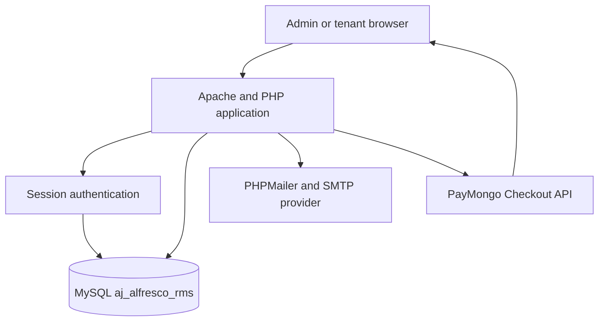
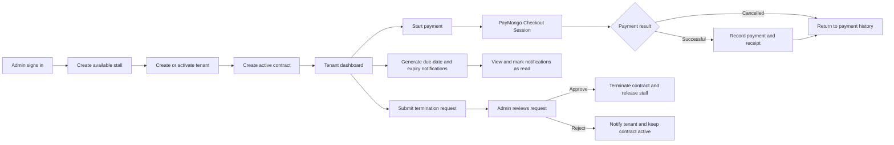

# A&J Alfresco Rental Management System
ABC
## Short description

A&J Alfresco is a web-based rental management system for food-park operations. It helps administrators manage stalls, tenants, contracts, payments, receipts, reports, and notifications, while tenants can view their rental information and pay online.

## Version History

### 2026-09-25

- Added contract status display for `ACTIVE`, `FOR RENEWAL`, `PENDING RENEWAL`, and `TERMINATED`.
- Added admin contract editing for tenant, stall, dates, deposit, duration, terms, and status.
- Kept contract monthly rent locked to the selected stall's stored rate during creation and editing.
- Added safe contract termination recovery through the edit form, including stall availability checks.
- Added an unread notifications filter and preserved the existing notification status colors.
- Added a print-friendly overdue tenant list accessible from the Tenants page.

### 2026-08-28

- Added automatic overdue-rent detection and email reminders for unpaid monthly rent.
- Added the `OVERDUE RENT EMAIL` option to the local reminder testing page.
- Allowed local access to the reminder testing page without requiring admin login; remote requests remain protected.
- Added SMTP email behavior and reminder-testing instructions to this README.
- Added database indexes for contracts, payments, and notifications to support 100+ users.
- Added a rerunnable `migrate_db.php` database performance migration.
- Restricted tenant renewal requests to the final 30 days of an active contract.
- Added a SweetAlert message for renewal attempts made too early and server-side enforcement of the same rule.
- Added consistent `OVERDUE` status display in the admin tenant list and tenant profile dialog.
- Replaced tenant table emoji actions with accessible Font Awesome icon buttons and enhanced the tenant profile dialog.
- Standardized PHP/MySQL application time handling and anchored the tenant dashboard countdown to server time.

## Features

### Admin portal

- Dashboard counts for available stalls, occupied stalls, active contracts, and payment activity
- Create and update stalls with a number, name, location, monthly rate, size, and status
- Register tenants and manage their account status and business details
- Create contracts that connect an active tenant to an available stall
- Edit contract details and lifecycle status, including restoring an accidentally terminated contract
- Track contract dates, rent, deposits, terms, duration, and lifecycle status
- View and print the current overdue tenant list from the Tenants page
- Record cash or manually verified payments
- View payment history, search records, and print receipts
- View payment reports
- Filter notifications by type or unread status, and mark them as read
- Review tenant termination requests and approve or reject them from the dashboard
- Force-send rent-due, overdue-rent, and contract-expiry email reminders from `admin/test_reminders.php`

### Tenant portal

- Secure login with separate admin and tenant roles
- Tenant dashboard with contract, payment, and reminder summaries
- View contract details and the generated PDF agreement
- Submit renewal and termination requests for an active contract
- Start a PayMongo Checkout payment for the current rental contract
- View payment history and print individual receipts
- Filter notifications by payment or contract expiry and mark them as read
- Change the account password

### Notifications and reminders

Loading `tenant/dashboard.php` runs the automatic reminder check for the signed-in tenant. Loading `admin/dashboard.php` checks all active tenants as well, and saving an active contract edit rechecks that tenant immediately. For reminders to run without a dashboard visit, schedule `run_reminders.php` daily with Windows Task Scheduler. A matching reminder creates an in-app notification and sends an email. The current active contract's `start_date` determines the monthly rent due day, and its `end_date` determines contract expiry reminders.

#### When emails are sent

- **Rent due:** 7, 3, and 1 day before the next monthly due date. If a dashboard check misses an earlier stage, it sends the closest applicable stage.
- **Overdue rent:** 1, 3, and 7 days after the current month's due date, when no `paid` payment exists for that contract and `payment_for_month`. Missing overdue stages are sent the next time reminders are checked.
- **Contract expiry:** exactly 90, 60, and 30 days before the active contract's `end_date`.

#### Schedule automatic checks on Windows

Run `install_reminder_task.ps1` in PowerShell from the project directory. It registers a current-user task that runs the CLI reminder runner when Windows records a system time change and daily at 8:00 AM. The current user must be logged in, XAMPP MySQL must be running, and SMTP must be configured. The task is safe to run more than once because date-specific milestones are deduplicated. After changing the PC clock, Windows triggers a new reminder check; only reminders whose date windows match the new system date will send.

Tenant renewal requests are available only during the final 30 days of an active contract. The contract page displays a SweetAlert when a tenant tries to request renewal too early, and the processing endpoint enforces the same rule server-side.

Reminder notification keys include the contract and applicable due date, so manually changing an active contract's start or end date creates a new reminder schedule without old notifications suppressing it. Each rent-due, overdue, and contract-expiry stage is sent at most once for that date. Payments marked `paid` prevent overdue emails for that month.

#### Where emails are sent

Emails are sent by PHPMailer through the SMTP account configured in `config/smtp.php`. The recipient is the tenant's `users.email` address, and the sender is `SMTP_FROM` with the display name `SMTP_FROM_NAME`. Gmail uses SMTP host `smtp.gmail.com`, port `587`, and STARTTLS. A Gmail app password must be used instead of the normal account password.

#### How to test reminder emails

1. Configure valid SMTP credentials in `config/smtp.php`.
2. Start Apache and MySQL in XAMPP.
3. Open `http://localhost/aj-alfresco/admin/test_reminders.php`.
4. Find an active contract and click the paper-plane button in the desired column:
    - **Contract Expiry Email**: choose 90, 60, or 30 days.
    - **OVERDUE RENT EMAIL**: sends an overdue-style email immediately.
    - **Rent Due Email**: choose 7, 3, or 1 day.
5. Check the tenant's email inbox and the PHP/Apache error log if sending fails.

The test page is intended for local development and bypasses automatic reminder deduplication. It is available locally without an admin login; requests from other machines still require admin authentication. SweetAlert2 is used for tenant action confirmations and notification dialogs.

Termination requests require administrator approval. A tenant submits a request from the contract page, the request appears in the admin dashboard, and the admin can approve or reject it. Approval changes the contract to `terminated` and makes the stall `available`; rejection keeps the contract active and notifies the tenant.

## Technology stack

- PHP 8.x
- MySQL with InnoDB and `utf8mb4`
- Apache and PHP through XAMPP
- Server-rendered HTML, CSS, and JavaScript
- PayMongo Checkout API
- PHPMailer through the included Composer vendor directory
- FPDF for generated contract documents
- SweetAlert2 and Font Awesome loaded from CDNs

## Requirements

- A local Apache/PHP/MySQL stack on Windows, Linux, or macOS
- PHP 8.x with the `mysqli` and `curl` extensions enabled
- A MySQL or MariaDB database server
- A PayMongo account and API keys for online payments
- A Gmail account with an app password, or another SMTP-compatible mail account

## Step-by-step setup

These steps are for a local PHP + MySQL environment on Windows, Linux, or macOS. Replace the project path with the web root used by your local server.

### 1. Clone the repository

Use the clone command that matches your operating system.

#### Windows (XAMPP / Apache + MySQL)

```powershell
cd C:\xampp\htdocs
git clone https://github.com/YoursTrulyInarius/aj-alfresco.git
cd aj-alfresco
```

#### Linux (Apache + MySQL / MariaDB)

```bash
cd /var/www/html
sudo git clone https://github.com/YoursTrulyInarius/aj-alfresco.git
cd aj-alfresco
sudo chown -R $USER:$USER /var/www/html/aj-alfresco
```

#### macOS (MAMP / native Apache)

```bash
cd /Applications/MAMP/htdocs
git clone https://github.com/YoursTrulyInarius/aj-alfresco.git
cd aj-alfresco
```

If the project is already downloaded, open its existing directory instead of cloning it again.

### 2. Start your local web server and database

- Windows: open the XAMPP Control Panel and start Apache and MySQL.
- Linux: start Apache and MySQL/MariaDB (`sudo systemctl start apache2` and `sudo systemctl start mysql` or `mariadb`).
- macOS: start MAMP, or start the built-in Apache service if you are using a native setup.

The application expects both the web server and the database service to be running.

### 3. Create the database

1. Open `http://localhost/phpmyadmin/`.
2. Select the Import tab.
3. Choose `sql/database.sql` from the project directory.
4. Run the import.

The script creates the `aj_alfresco_rms` database, its tables, and the default administrator account. The same SQL file can also be run with the MySQL command line.

### 4. Configure the database connection

Open `config/database.php` and confirm the local connection values:

```php
$host = 'localhost';
$user = 'root';
$pass = '';
$db   = 'aj_alfresco_rms';
```

Use the username and password configured by your MySQL installation if they differ from the XAMPP defaults.

### 5. Configure PayMongo

Set the PayMongo environment variables used by `config/paymongo.php`:

```powershell
$env:PAYMONGO_SECRET_KEY = 'YOUR_PAYMONGO_SECRET_KEY'
$env:PAYMONGO_PUBLIC_KEY = 'YOUR_PAYMONGO_PUBLIC_KEY'
```

Get these values from the PayMongo Dashboard under Developers or API keys. Use test keys during development. The application builds its success and cancel URLs from the current request host, so local testing uses the `localhost` address automatically.

Do not commit real PayMongo keys. Keep this file private or use a deployment-specific configuration file.

### 6. Configure SMTP email

Set the SMTP environment variables used by `config/smtp.php`:

```powershell
$env:SMTP_HOST = 'smtp.gmail.com'
$env:SMTP_PORT = '587'
$env:SMTP_USERNAME = 'your_email@gmail.com'
$env:SMTP_PASSWORD = 'your_app_password_here'
$env:SMTP_FROM = 'your_email@gmail.com'
$env:SMTP_FROM_NAME = 'A&J Alfresco'
```

For Gmail, enable two-step verification and create an app password. Use the app password in `SMTP_PASSWORD`, not the normal Gmail password. Confirm that the sender address matches the configured SMTP account.

Do not commit real SMTP credentials or share them in issues, screenshots, or source files.

### 7. Run the application

Visit the Apache-served project URL:

```text
http://localhost/aj-alfresco/
```

The default database script creates an administrator account:

- Email: `admin@ajalfresco.com`
- Password: `admin123`

Change this password immediately after the first login. Admins create tenant accounts from the admin portal; tenants then sign in with their assigned email and password.

### 8. Verify the installation

1. Sign in as the default administrator.
2. Create an available stall from `admin/stalls.php`.
3. Create a tenant from `admin/tenants.php`.
4. Create an active contract from `admin/contracts.php`.
5. Open the tenant dashboard and confirm the contract appears.
6. Use `admin/test_reminders.php` to test SMTP reminders.
7. Use PayMongo test keys and test payment methods to verify online checkout.

### 9. Apply database performance updates

For an existing installation, run the migration after importing the database:

```powershell
& 'C:\xampp\php\php.exe' migrate_db.php
```

The migration is safe to run again. It updates the payment method column for online payment values and adds indexes used by active-contract lookups, payment-by-month checks, payment history, unread notifications, and reminder notification checks.

## Configuration reference

- `config/database.php`: MySQL connection settings.
- `config/paymongo.php`: PayMongo secret key, public key, and generated callback URLs.
- `config/smtp.php`: SMTP host, port, account, app password, sender address, and sender name.
- `sql/database.sql`: Database schema and default administrator seed.
- `includes/functions.php`: Shared authentication, database, notification, and email helpers.

The application uses `Asia/Manila` consistently for PHP and the MySQL connection. Server-generated dates control payment, overdue, renewal, and reminder decisions. The tenant dashboard countdown is anchored to server time, so changing the local PC clock does not create a conflicting countdown.

The tenant portal uses the shared admin-style navigation shell across the dashboard, contract, payment, notification, and password pages. Contract, payment, and password forms include responsive card layouts for desktop and mobile screens.

The repository contains placeholders for external credentials. Replace them only in a private deployment configuration and rotate any key that has been exposed.

## System architecture



## System process flow



## Main routes

| Area | Entry points |
| --- | --- |
| Login | `index.php` |
| Admin | `admin/dashboard.php`, `admin/tenants.php`, `admin/stalls.php`, `admin/contracts.php`, `admin/payments.php`, `admin/reports.php`, `admin/notifications.php` |
| Tenant | `tenant/dashboard.php`, `tenant/contract.php`, `tenant/make_payment.php`, `tenant/payments.php`, `tenant/notifications.php` |
| Testing | `admin/test_reminders.php`, `tenant/diagnose.php`, `tenant/simulate_payment_success.php` |

## Project structure

```text
admin/                  Admin pages and form handlers
assets/css/             Shared responsive stylesheet
assets/js/              Shared browser behavior
config/                 Database, PayMongo, and SMTP configuration
includes/functions.php  Authentication, database, notifications, and mail helpers
includes/fpdf/          Contract PDF generation library
tenant/                 Tenant pages and payment handlers
sql/database.sql        Database schema and default admin seed
vendor/                 Composer autoload and installed libraries
```

## Payment flow

1. A tenant opens `tenant/make_payment.php` and starts a checkout.
2. The server creates a PayMongo Checkout Session.
3. PayMongo handles the payment page and redirects to `tenant/payment_success.php`.
4. The success handler checks the session, prevents duplicate references, and records a paid payment.
5. The tenant can view or print the generated receipt from payment history.

For local testing without a live payment, use `tenant/simulate_payment_success.php` only in a controlled development environment.

## Security notes

- Keep `config/paymongo.php` and `config/smtp.php` out of public source control when they contain real values.
- Rotate any credential that has ever been committed or shared.
- Use HTTPS in production.
- Replace the seeded admin password immediately.
- Restrict diagnostic and payment simulation pages to development or remove them before deployment.

## Scaling notes

The application uses indexed queries for the main growing tables. Contracts are indexed by tenant and status; payments are indexed by contract/month/status and tenant/date; notifications are indexed by user/read state and user/type. These indexes keep the common dashboard, payment, and notification lookups efficient as the system grows beyond 100 users.

Reminder email checks currently run when a tenant opens the dashboard. For a larger production deployment, schedule a server-side reminder worker to process active tenants independently of login activity, and keep SMTP sending out of normal browser requests by adding an email queue with retries.
